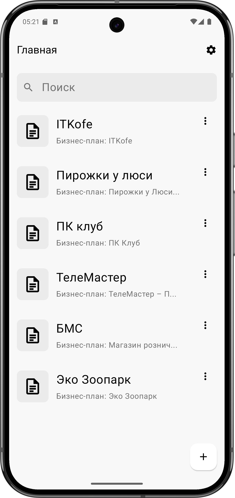
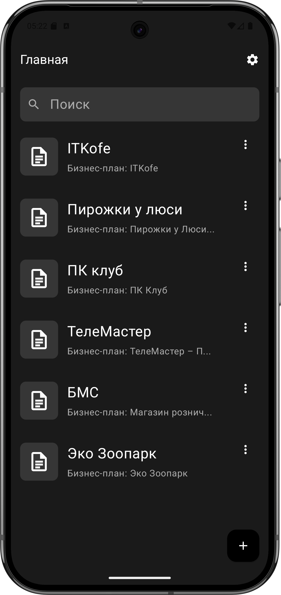
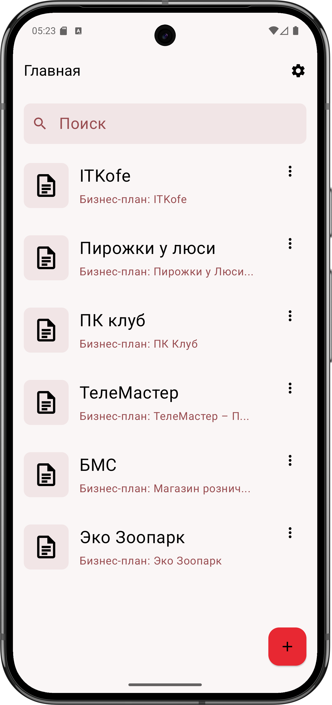
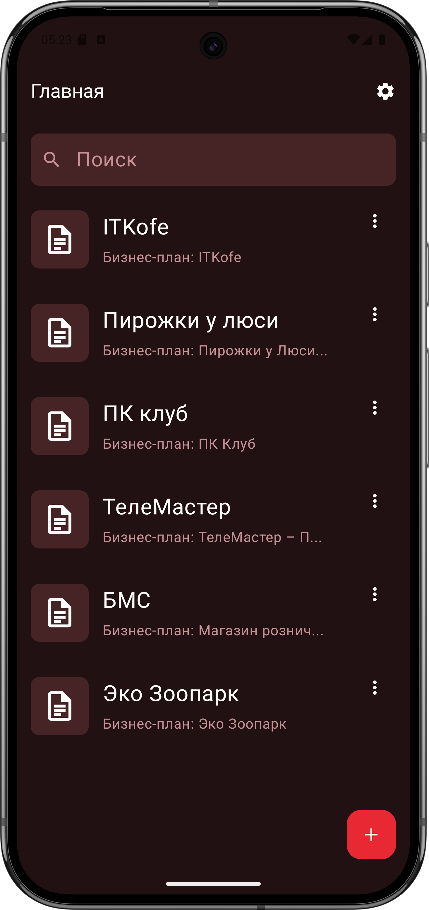
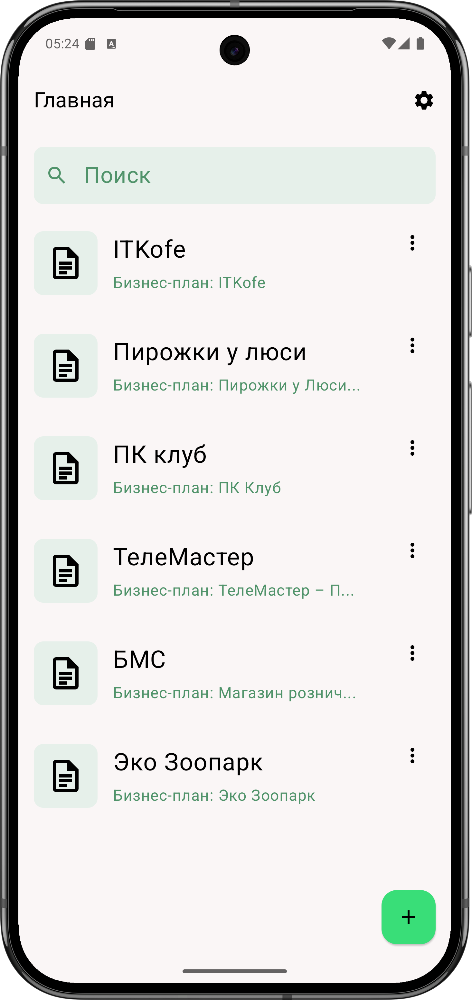
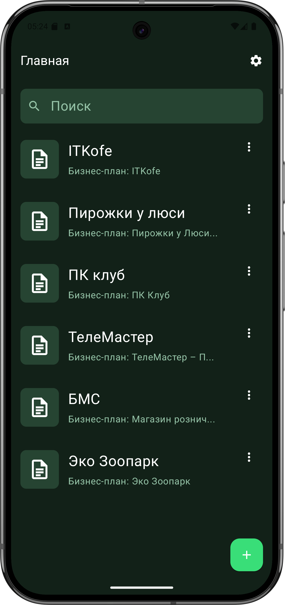

# 📊 BusinessPlanAI

<h1 align="center">🤖 Генератор бизнес-планов с помощью ИИ</h1>

  
  Адаптивное Android-приложение для создания профессиональных бизнес-планов с использованием искусственного интеллекта.

---

## 📖 О проекте

**BusinessPlanAI** — это современное Android-приложение, которое помогает пользователям быстро и просто создавать профессиональные бизнес-планы. Введите основную информацию о вашем бизнесе, и приложение автоматически сгенерирует структурированный и готовый к использованию бизнес-план с помощью модели ИИ **Gemma-3-4b-it-qat**.

---

## ✨ Основные возможности

| Функция                          | Описание                                                                      |
| -------------------------------- | ----------------------------------------------------------------------------- |
| 📝 **Создание бизнес-планов**    | Пользователь вводит ключевые параметры, и ИИ генерирует детальный бизнес-план |
| 🤖 **Генерация с помощью ИИ**    | Используется модель Gemma-3-4b-it-qat через HTTP-запросы                             |
| 💾 **Сохранение бизнес-планов**  | Все планы сохраняются в локальную базу данных SQLite                         |
| 💾 **Сохранение бизнес-планов в PDF, WORD**  | Возможность открыть или поделиться бизнес планом                         |
| 🔄 **Редактирование и удаление** | Возможность редактировать и удалять ранее созданные планы                   |
| 📄 **Просмотр планов**           | Отображение детальной информации о каждом плане с Markdown рендерингом               |

---

## 📱 Адаптивность

Приложение полностью **адаптивно** и отлично работает на различных размерах экранов:

- 📱 **Смартфоны** - Оптимизированный интерфейс для мобильных устройств
- 📟 **Планшеты** - Адаптированная компоновка для больших экранов
- ⌨️ **Поддержка клавиатуры** - Автоматическая настройка отступов при появлении клавиатуры  

Responsive дизайн достигается благодаря использованию гибких модификаторов Compose и адаптивных компонентов Material 3.

---

## 🖼️ Экраны приложения

| Экран                       | Назначение                                                                |
| --------------------------- | ------------------------------------------------------------------------- |
| 🏠 **Главный экран**        | Список всех сохранённых бизнес-планов с возможностью поиска         |
| ➕ **Экран добавления**      | Форма ввода данных для генерации нового плана   |
| ✏️ **Экран редактирования** | Изменение ранее созданного плана               |
| 👁️ **Экран просмотра**     | Полный просмотр информации по плану с Markdown форматированием            |

---

## 🛠️ Технологический стек

### 📌 Языки и инструменты

* 🧠 **Kotlin** — основной язык разработки 
* 🧱 **Gradle Kotlin DSL** — система сборки 
* 🎯 **Target SDK 35** — поддержка новейших Android функций

### 📚 Архитектура и библиотеки

| Библиотека                   | Назначение                          |
| ---------------------------- | ----------------------------------- |
| 🔗 **Jetpack Compose**       | UI на декларативной основе          |    
| 🎨 **Material 3**            | Современный дизайн Google           |  
| 🧠 **MVVM**                  | Архитектура (ViewModel, State)      |   
| 💾 **Room Database**          | Работа с локальной SQLite БД        | 
| 🌐 **Ktor Client**           | Выполнение HTTP-запросов к ИИ       | 
| 📦 **Kotlinx Serialization** | Работа с JSON                       | 
| 🧭 **Navigation Compose**    | Навигация между экранами            | 
| 🕺 **Lottie Compose**        | Анимации и микроинтеракции           | 
| 📝 **Markdown Renderer**     | Отображение форматированного текста |
| 🎭 **Core Splashscreen**     | Современный экран загрузки          | 
* И другие библиотеки для WORD и PDF

---

## 🧠 Искусственный интеллект

Приложение использует современную модель **Gemma-3-4b-it-qat** для генерации высококачественных бизнес-планов. Коммуникация происходит через защищённые HTTP-запросы, результаты автоматически форматируются и сохраняются в базу данных.

### 🎛️ Параметры ИИ модели:
- **Temperature: 0.1** - для более точных и структурированных ответов 
- **Max tokens: 5000** - для детальных бизнес-планов 
- **Timeout: 10 минут** - для обработки сложных запросов 

---
## 📊 Экспорт документов

Одной из самых сложных задач в разработке было реализовать **конвертацию Markdown в различные форматы документов**. Было особенно трудно добиться корректного преобразования:

- 📝 **Markdown → HTML** - Сохранение форматирования и стилей
- 📄 **HTML → PDF** - Правильная разбивка на страницы и typography  
- 📋 **HTML → WORD** - Совместимость с Microsoft Office форматами

Несмотря на техническую сложность, **все функции экспорта работают отлично** и позволяют пользователям получать профессионально оформленные документы в нужном формате. Приложение использует продвинутый Markdown рендеринг [35](#0-34)  с полной поддержкой стилизации.

---

## 📸 Скриншоты и демонстрация
| Светлая                      | Темная                              | Светлая Красная             | Темная Красная                      |Светлая Зеленая              |Темная Зеленая|           
| ---------------------------- | ----------------------------------- |---------------------------- | ----------------------------------- |---------------------------- | ----------------------------------- |
|||||||

* Видео ускоренно в 2 раза
---

## ⚠️ Технические особенности

* Приложение требует **стабильного интернет-соединения** для генерации бизнес-планов 
* Строгое разделение логики по архитектуре **MVVM** 
* Все бизнес-планы хранятся **только локально** в SQLite 
* Поддержка **Edge-to-Edge** дизайна для современных устройств 
* Автоматическая адаптация под **тёмную и светлую темы** системы

---

## 🚀 Установка и запуск

1. Загрузите последнюю версию **APK** из раздела [Releases](https://github.com/Egor228000/BusinessPlanAI/releases)
2. Установите APK на ваше Android‑устройство
3. Запустите приложение "МатеМагия"

---

## 📈 Будущие обновления

- 🌐 Поддержка нескольких языков интерфейса
- ☁️ Облачная синхронизация планов
- 🎨 Дополнительные темы оформления

